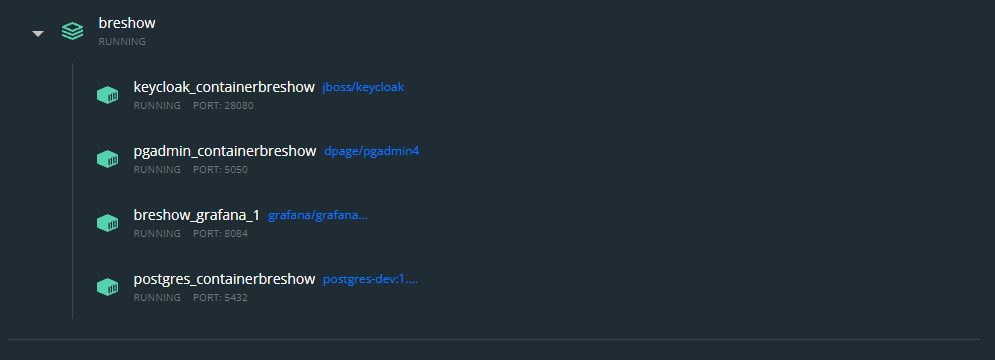
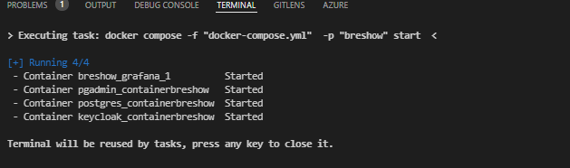

# BreShow
  Projeto desenvolvido para a matéria de Trabalho de Conclusão de Curso (TCC) do curso de Engenharia Eletrônica e de Computação da Universidade Federal do Rio de Janeiro com o intuito de se adquirir o diploma e o título de bacharelado em engenharia eletrônica pela UFRJ. 
## Introdução
  O projeto BreShow consiste num protótipo de ERP voltado inicialmente para a área de brechó. Na fase o qual se encontra, temos o módulo da Aplicação Web que consiste numa Aplicação de Única Página (SPA) onde é adicionado informações sobre as vendas através de formulários, o módulo de dashboard que nos mostra de forma macro e agrupado as vendas de um determinado período e o módulo de gerenciamento de usuário, servindo para gerenciar os usuários do módulo da aplicação web.

  Para mais informações sobre o projeto, baixe o pdf do TCC clicando no [link](https://github.com/VenancioIgrejas/BreShow/blob/master/ProjetoFinalUfrjBreShow.pdf).

## Instalação
Para a instalação, siga todos os passos na ordem para não ter nenhum problema e espere finalizar cada passo a passo para ir pro próximo.
### Pré-requisitos
  - Ter o Git instalado na máquina
  - Ter o [Docker](https://www.docker.com/) instalado na máquina
  - Ter a ultima versão do [Node e npm](https://nodejs.org/en/) instalados
  - Ter no mínimo 8GB de Memória VRAM

### Clonando o repositório
Primeiramente, abra o terminal de comando na pasta que deseja clonar o repositório e digite os seguinte comandos: 
```
git clone https://github.com/VenancioIgrejas/BreShow.git BreShow
```
```
cd ./BreShow
```

Após os seguintes comandos, verá que o seu terminal estará apontando para dentro da pasta do projeto. Iremos chamar isso de __raiz do projeto__ ou __raiz__ para facilitar o entendimento.

### Composição dos Contêineres 

__OBS: O Docker precisa estar online na sua máquina e funcionando__

Para rodar a composição dos contêineres, onde estão contidos o módulo de dashboard, módulo do gerenciador de usuários e o banco de dados, basta rodar o seguinte comando dentro da pasta raiz:

```
docker-compose up
```
aguarde até todos os contêineres estiverem rodando e finalizados as instalações. Caso utiliza o Docker-Desktop, ele deve estar parecido com essa figura no final da instalação:



### Aplicação Web
Primeiramente, devemos instalar os pacotes Node tanto do FrontEnd (Angular 12) quanto do BackEnd (NestJS). Caso seja a sua primeira vez, basta rodar script:

```
./installApp.sh
```

Esse script irá instalar automaticamente e em paralelamente os pacotes necessários para o funcionamento da ferramenta do angular 12 e do NestJS, além de gerar a migração dos dados da aplicação para o banco de dados, criando assim as estruturas de tabelas e relacionamentos. Quando tudo tiver completado, o seu terminal precisa estar com o seguinte formato:

FrontEnd(Angular12):
<br/><br/>

<br/><br/>
BackEnd(Angular12):
<br/><br/>


## Iniciando Projeto
Para iniciar o projeto basta inicializar a composição de contêineres utilizando o comando na raiz do projeto no terminal:
```
docker-compose up
```

E em outro terminal, rodar o comando de inicialização dos dois serviços do módulo da Aplicação Web:
```
./startDevApp.sh
```

Após a inicialização completa dos dois, os terminais devem ficar parecidos com essas imagens:




Para acessar os módulos, basta escrever as seguintes urls no navegar de acordo com a sua necessidade:

  - Aplicação Web -> http://localhost:4200/
  - Dashboard -> http://localhost:8084/login
  - Gerenciador de Aplicativos -> http://localhost:28080/auth/

__OBS:__ Senhas e configurações encontram-se nos arquivos _docker-compose.yml_ ou _.env_ 

## Desativando
Para desativar/desligar o sistema, basta __fechar o terminal__ onde esteja rodando o serviço da Aplicação Web e, no caso da composição dos contêineres, basta rodar o seguinte trecho na raiz do projeto:

```
docker-compose stop
```

## Desinstalando
Primeiro rode o seguinte código no terminal da raiz do projeto:

```
docker-compose Down
```

e após finalizar a remoção da composição dos contêineres, basta deletar a pasta do BreShow.
